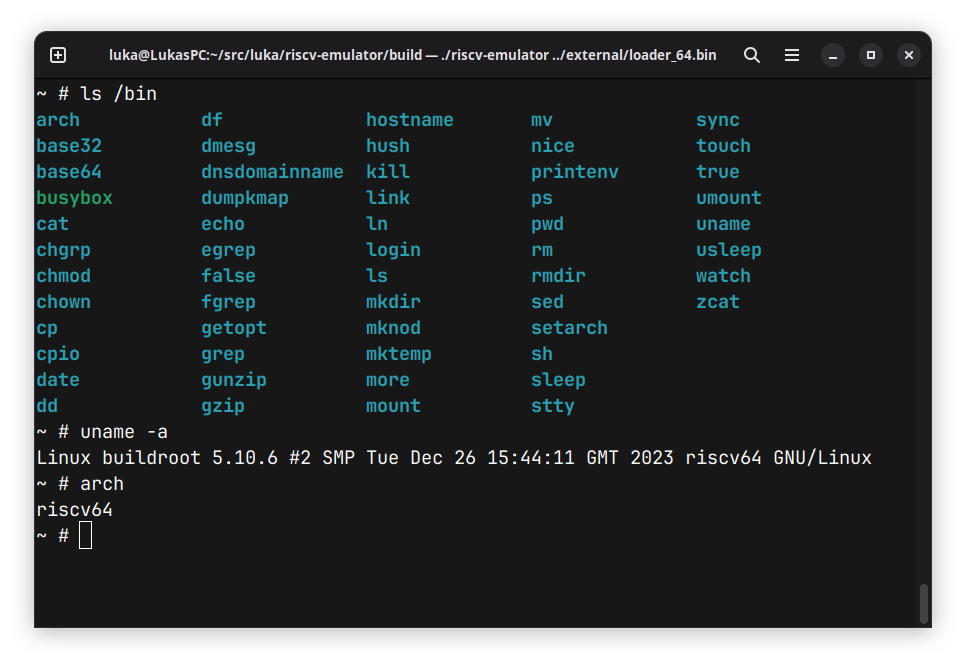

# riscv-emulator
A RISC-V emulator capable of running Linux, written in C++.


## Supported extensions
* RV64I
* A (atomics)
* C (compressed instructions) - partial support
* M (multiplication)
* Zicsr (CSRs)

## Running Linux
The emulator is capable of running a minimal version of Linux without MMU support.
You can find instructions for building an image [https://github.com/franzflasch/linux_for_riscv_em](here).

## Supported peripherals
* CLINT
* PLIC
* UART (simple-uart driver for the above Linux)

## Test coverage
You can find the official RISC-V test suite [https://github.com/riscv-software-src/riscv-tests](here).
Currently, the emulator is capable of passing all tests for the base instruction set and supported extensions.

## Building free-standing toolchain
For running the RISC-V test suite, you may wish to build a freestanding toolchain.
```
export RISCV=/path/to/my/new/toolchain
git clone https://github.com/riscv/riscv-gnu-toolchain
cd riscv-gnu-toolchain
./configure --prefix=$RISCV --with-arch=rv64ima_zicsr_zifencei
make -j 16
```
