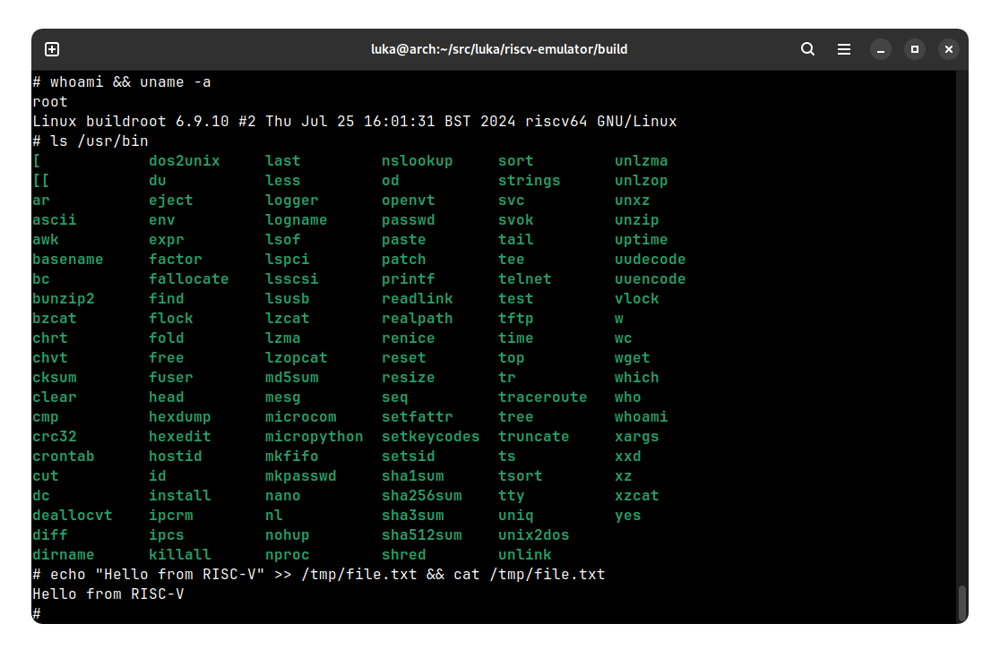

# riscv-emulator
A RISC-V emulator capable of running Linux (6.9.10), written in C++.


## Supported Extensions
* RV64I
* A (atomics)
* C (compressed instructions)
* M (multiplication)
* F (floating point)
* D (doubles)
* Zicsr (CSRs)
* Zicntr (counters and timers)
* Zifencei (fences)

(i.e. RV64GC)

Sv39 paging is also supported.

## Supported Peripherals
* CLINT
* PLIC
* UART (8250)
* Virtio block device

## Test Coverage
You can find the official RISC-V test suite [here](https://github.com/riscv-software-src/riscv-tests).
Currently, the emulator is capable of passing all tests for the base instruction set and supported extensions.

## Running Tests
For running the RISC-V test suite, you may wish to build a freestanding toolchain.
```
export RISCV=/path/to/my/new/toolchain
git clone https://github.com/riscv/riscv-gnu-toolchain
cd riscv-gnu-toolchain
./configure --prefix=$RISCV --with-arch=rv64gc
make -j 16
```
Alternatively, download a pre-built binary from the releases page (riscv64-elf-ubuntu-*-gcc-nightly) or, on Arch Linux, install the AUR package [riscv64-gnu-toolchain-elf-bin](https://aur.archlinux.org/packages/riscv64-gnu-toolchain-elf-bin).

Then build the tests as so:
```
# clone and configure
cd external
git clone https://github.com/riscv/riscv-tests
cd riscv-tests
git submodule update --init --recursive
autoconf
./configure

# build relevant tests
cd isa
make -j 16 rv64ui rv64ua rv64uc rv64um rv64uf rv64ud rv64si rv64mi
rm *-v-*

# convert ELF to bin
rm -f *.bin
for file in *; do if [[ -x "$file" && ! -d "$file" ]]; then riscv64-unknown-elf-objcopy -O binary "$file" "$file.bin"; fi; done
```

Then run the tests:
```
# in project's root directory
python run_tests.py
```

## Running Linux

### initramfs
First you must build the initramfs. Currently I use buildroot with support for the following binaries:
- nano
- bash
- micropython
- busybox

```
cd external/buildroot
./build.sh
```

Building on an i5-7600K takes just under 30 minutes and uses 7 GB of disk space. It will build slightly faster if you modify `buildroot.config` to remove everything except busybox.

Alternatively, you can [download a pre-built version here](https://github.com/lukawarren/riscv-emulator/releases), to be placed under `external/buildroot/rootfs.cpio`.

**You must re-run the kernel's `build.sh` (see below) whenever the initramfs changes.**

### Kernel
Install the Linux toolchain (as opposed to the elf toolchain) by following the instructions above for building tests but running `make linux` instead of `make`. If you wish to download a pre-built version of the toolchain instead, follow the same steps as previously described but swap `-elf-` with `-glibc-`. Then:
```
# Build
cd external/linux
./build.sh

# Run
cd -
cd build
cmake .. -G Ninja && ninja
./riscv-emulator --image ../external/linux/image.bin --dts ../emulator.dts
```

Alternatively, if you do not wish to build Linux and OpenSBI from source *and* you do not wish to build the initramfs either, you can [download a pre-built final image here](https://github.com/lukawarren/riscv-emulator/releases), so that you can simply run `./riscv-emulator image.bin`.

## Attaching a block device
If you don't have an image handy, you can make a simple ext4 filesystem containing the emulator's source like so:
```
# Adjust size as necessary
dd if=/dev/zero of=fs.img bs=10M count=200
mkfs.ext4 fs.img
sudo mkdir /mnt/temp-riscv
sudo mount -o loop fs.img /mnt/temp-riscv
sudo cp -r src/* /mnt/temp-riscv
sudo umount /mnt/temp-riscv
sudo rm -r /mnt/temp-riscv
```
Then you can run Linux, etc. with `./riscv-emulator --image ../external/linux/image.bin --dts ../emulator.dts --blk fs.img`
